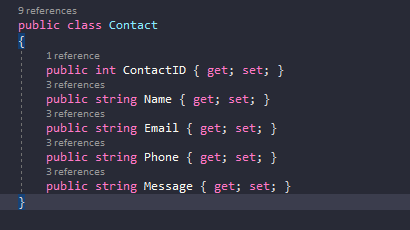
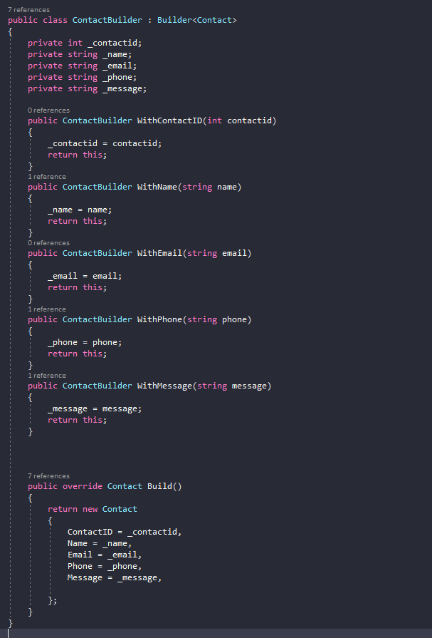

# TestDataBuilderCodeGenerator
This little console app takes some of the tedium out of creating data builder objects.

### Convert POCO :

### To POCO-Builder :

### Steps

1. Copy POCO Contents
2. Run TestDataBuilderGenerator.exe
3. Select the Second Option to convert POCO
4. Press enter to paste into the generator
5. Press enter to convert.
6. The Builder Class is now copied to your clipboard.
7. Paste contents into desired destination file.

#### Extras
You can access the Base Builder<T> class through the TestDataBuilderGenerator.exe by selecting option 1 from the option list. Doing this will copy the base class to your clipboard so you don't have to re-write it for every project. 
